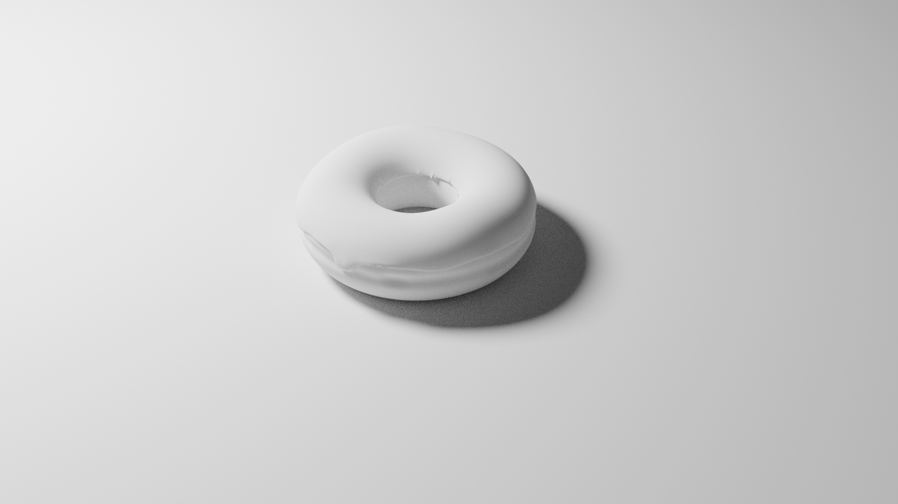
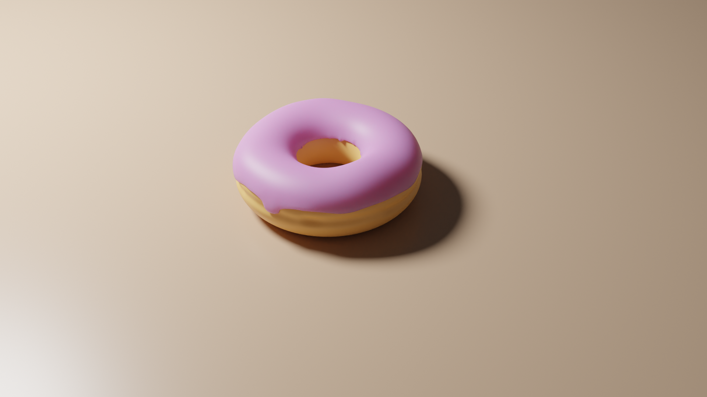

# Blender Tutorial

- https://www.youtube.com/playlist?list=PLjEaoINr3zgEq0u2MzVgAaHEBt--xLB6U
- https://www.blenderguru.com

## Requirements

- Blender 2.82a
- Git LFS

## Render

### Level 1

The steps in Level 1 are to create mesh and material.

| Created Mesh | Created Material | Applied Denoiser |
| --- | --- | --- |
|  |  |  |
