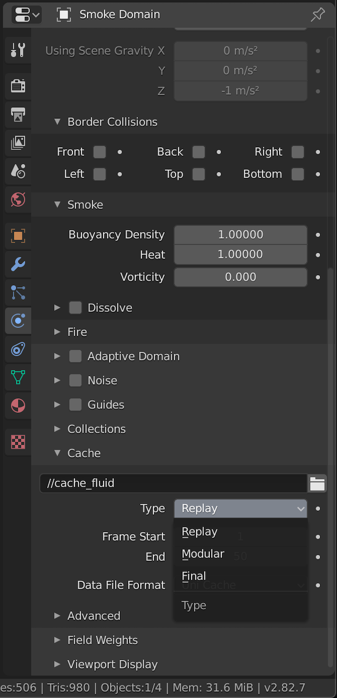

# Note

### Level1-1

- If smoke is not displayed
    - Change `Smoke Domain > Physics Properties > Cache > Type` from `Modular` to `Replay`

### Level1-6

- Parenting is not working
    - Choose parent first and child sencond
    - Use F3 and choose `Parenting`
    - Choose `Object`
